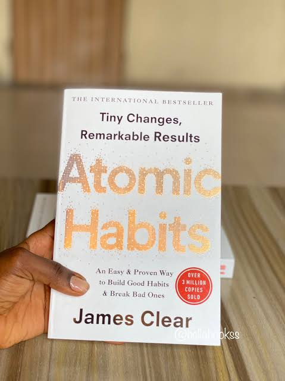
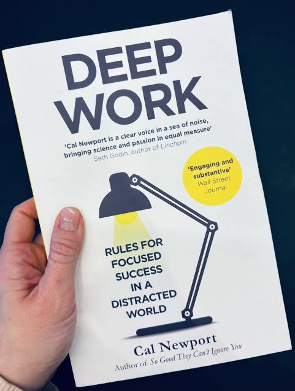
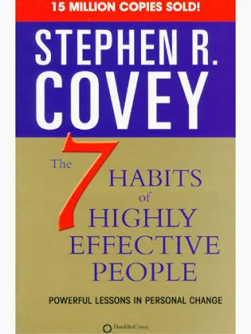
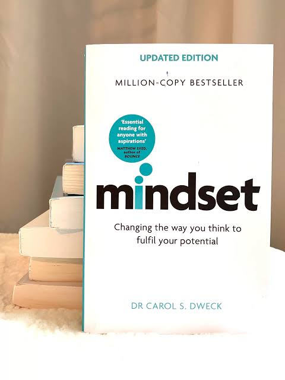
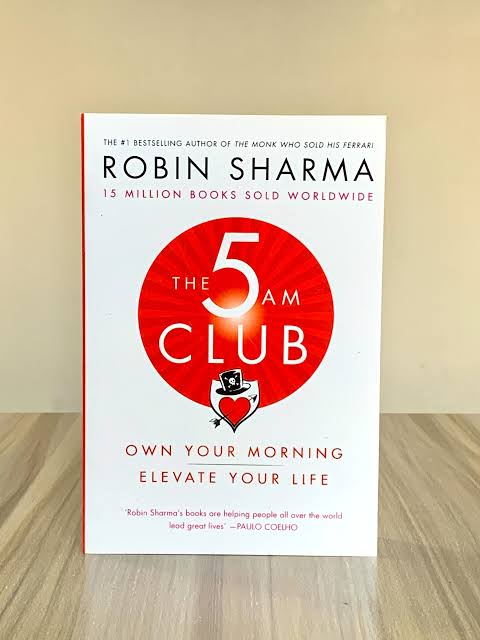
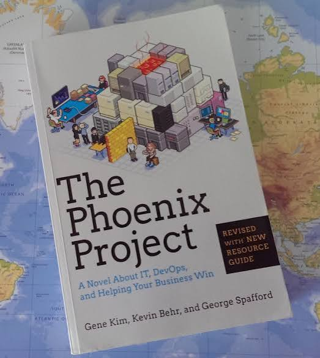
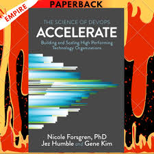

# Week 01 — Success Mindset (Mindset OS)

Part of the DevOps Micro Internship (DMI) Cohort 3 with Agentic AI

---

## Purpose (Read This First)

This week is not motivation homework.

This is you building your **Mindset OS** — the system you will use for the next 5 months (and honestly, for years).

### Expectations

* Be honest.
* Be specific.
* Be practical.
* Write like an adult professional: clear sentences, no one-liners.

You will reuse this in later weeks. So do it properly once.

---

# Assignment 1. What is something you believe to be true that most people around you would disagree with?

### Rules

* No "safe" answers.
* Must be your real belief (not copied from internet).
* Minimum 50 words.

**Hint:** What do you believe about career, money, learning, discipline, relationships, health, success, life, tech industry, etc. that most people don't agree with?

## Answer

I believe that a successful career in technology is not built by chasing every new tool or trend but by developing the ability to deeply understand systems, solve problems, and consistently deliver value. Many people believe that success in tech comes mainly from learning the newest programming language, collecting certifications, or having the perfect background. However, my experience has shown me that curiosity, discipline, and the ability to troubleshoot when things break are more valuable long term.
Coming from an Electrical Engineering background into software development, cloud support, and DevOps, I discovered that the most important skill is not knowing everything but having the mindset to figure things out. Technologies will always change, but someone who can learn, adapt, debug, communicate, and build reliable solutions will always remain valuable.

---

# Assignment 2. What are the top 3 objective truths you discovered through experimentation and results?

### Definition

Objective truths do not depend on opinions. They hold true regardless of how people feel.

Write each truth in this format:

**Truth:** (1 sentence)

**Evidence from my life:** (2–4 lines: what you tried + what happened)

---

## Truth #1

### Truth

Consistent small improvements compound into significant career growth.

### Evidence from my life

When I started transitioning deeper into software development and cloud technologies, I did not master everything immediately. I spent time consistently learning programming, building projects, practicing Git, understanding APIs, and later learning Azure and DevOps concepts.
The results became visible over time. I progressed from building frontend applications to developing full-stack applications, then moved into technical support engineering where I now troubleshoot cloud infrastructure and customer environments.

---

## Truth #2

### Truth

The ability to troubleshoot and understand systems is more valuable than memorizing tools.

### Evidence from my life

Working as a Technical Support Engineer exposed me to real-world cloud problems where solutions were not always straightforward. I had to analyze issues, investigate logs, understand API behavior, work with Azure services, and identify root causes.
This experience taught me that tools change, but problem-solving principles remain constant. Understanding how systems communicate and fail has helped me become better at supporting customers and improving solutions.

---

## Truth #3

### Truth

Building and documenting real projects creates more opportunities than only studying theory.

### Evidence from my life

I noticed that my practical projects helped me progress faster. Building applications with .NET, APIs, databases, and frontend technologies gave me experience I could demonstrate.
Creating projects, maintaining GitHub repositories, and working with real technologies made my learning more practical and helped me move into professional software and cloud roles.

---

# Assignment 3. What does your 2.0 version look like?

### Instructions

Write as if a journalist is writing about you **3 to 7 years from now** (not 20 years).

**Minimum 300 words.**

### Rules

* Write in past tense, like it already happened.
* Don't use "likes to / wants to / hopes to."
* Use specifics:

  * built
  * shipped
  * led
  * published
  * earned
  * relocated
  * contributed
* Include skills proof:

  * projects
  * portfolios
  * GitHub
  * blogs
  * certifications
  * job role
  * leadership
  * community contribution
* Add 1–3 images if you can (optional but powerful).

### Publish It Publicly On Any ONE

* LinkedIn
* Medium
* WordPress
* Blogspot
* Personal blog
* Portfolio page

Include this line:

> **P.S. This post is a part of DevOps Micro Internship with Agentic AI Cohort-3 by [Pravin Mishra](https://www.linkedin.com/in/pravin-mishra-aws-trainer/). You can start your DevOps journey by joining this [Discord community](https://discord.pravinmishra.com/) ( https://discord.pravinmishra.com/ ).**

## Your Article

The Journey of Tobby Taiwo: From Engineering Graduate to Cloud and DevOps Engineer

Five years ago, Tobby Taiwo began his journey with a background in Electrical Engineering and a curiosity for how technology systems worked. Today, he has become a Cloud and DevOps Engineer known for building reliable systems, automating processes, and helping teams deliver scalable solutions.
After graduating with an Engineering degree, Tobby continued developing his skills in software engineering and cloud technologies. He built and shipped software projects involving frontend applications, backend APIs, databases, and deployment workflows. His portfolio demonstrated his ability to understand applications from development to production.
During his career progression, he worked with cloud infrastructure, supporting enterprise environments and troubleshooting complex technical issues. He contributed to improving system reliability by investigating incidents, optimizing configurations, and automating repetitive processes.
Tobby developed strong expertise in cloud platforms, containerization, CI/CD practices, infrastructure automation, and system troubleshooting. He worked with technologies including Azure services, Kubernetes, Docker, scripting tools, APIs, and automation frameworks.
His GitHub portfolio became a reflection of his growth, containing projects that demonstrated practical implementation rather than only theoretical knowledge. He documented his learning journey, shared technical insights, and contributed to the developer community.
Beyond technical skills, Tobby became recognized for his ability to communicate complex technical concepts clearly and collaborate with different teams. His experience working with customers and engineers helped him bridge the gap between technical solutions and real-world business needs.
He also earned professional certifications, continued improving his DevOps skills, and contributed to building reliable cloud systems used by organizations.
Looking back, his biggest achievement was not learning a particular tool but developing the mindset of continuous improvement, problem-solving, and building things that create real impact.
P.S. This post is a part of DevOps Micro Internship with Agentic AI Cohort-3 by Pravin Mishra. You can start your DevOps journey by joining this Discord community ( https://discord.pravinmishra.com/ ).

### Public Link

Paste your link here:
https://medium.com/@taiwotobiloba1/the-journey-of-tobby-taiwo-from-engineering-graduate-to-cloud-and-devops-engineer-2ec674f2c46a
`__________________________`

---

# Assignment 4. Have you ever cut corners (unethical / dishonest / shortcut behavior — not necessarily illegal)? If yes, how did it make you feel?

### Important

You don't need to write the full story.

Focus on the feeling:

* guilt
* fear
* shame
* stress
* regret
* numbness
* etc.

This is about self-awareness, not judgment.

### Answer Format

**Yes **

If Yes:

**What emotion did you feel?** (minimum 50–100 words)

## Answer

In the past, whenever I took shortcuts(probably using ai for all my work) instead of properly understanding a concept or completing a task the right way, I felt temporary relief but later experienced regret because I knew I had reduced my opportunity to truly learn.
One example is when learning technical concepts and focusing too much on finishing tasks instead of understanding the underlying principles. Over time, I realized that shortcuts create gaps that eventually appear when facing real-world problems.
This taught me that discipline and doing things properly are more valuable than rushing for quick results. I now try to focus on building strong foundations because the quality of my skills determines the quality of my work.

---

# Assignment 5. What are 10 non-fiction books you plan to read in the next 1 year?

### Rules

* Mention **Title + Author**
* Any language allowed
* No fiction novels

### Tip

Choose books that improve:

* mindset
* communication
* productivity
* health
* money
* career
* leadership

## Book List

1. Atomic Habits by James Clear

2. Deep Work by Cal Newport

3. The Psychology of Money by Morgan Housel

4. The 7 Habits of Highly Effective People by Stephen Covey

5. Mindset by Carol Dweck

6. So Good They Can't Ignore You by Cal Newport

7. The 5am Club by Robin Sharma

8. Clean Code by Robert C. Martin

9. The Phoenix Project by Gene Kim

10. Accelerate by Nicole Forsgren, Jez Humble & Gene Kim

---

# Assignment 6. What are the things you will measure regularly in your life and career?

### Rules

List topics only. No need to share numbers.

### Must Include

* Learning / skill
* Output / proof
* Health / energy
* Time / focus
* Money / finance (personal or business)

### Example

* Learning hours per week
* Deep work sessions per week
* Projects shipped / documented
* Steps / workouts
* Sleep hours
* Spending tracker

## My Metrics

* Learning hours per week
* DevOps/cloud concepts completed
* Projects shipped
* GitHub contributions
* Technical documentation written
* Certifications completed
* Deep work sessions completed
* Sleep quality and energy level
* Exercise consistency
* Time spent on social media

---

# Assignment 7. Brain Dump + 5-Month System Plan

## Step 1: Brain Dump (Private)

Do a brain dump of everything in your mind into a notebook.

Examples:

* Bills
* Tasks
* Worries
* Goals
* Pending messages
* Ideas
* Responsibilities

### Did You Do It?

**Yes **

Answer:

I wrote down my responsibilities, career goals, learning targets, projects I want to complete, skills I need to improve, financial goals, and personal commitments.

---

## Step 2: Your 5-Month Routine + Focus Blocks

Create a simple plan you can realistically follow for the next 5 months.

### Weekly Routine

Example:

* Mon–Thu: 60 min deep work
* Sat: DMI session
* Sun: Weekly review

#### My Weekly Routine

* Mon-Thu: 1–2 hours of focused learning, document learning notes
* Saturday: Take 8 hours DMI class
* Sunday: Weekly reflection, Review progress, Plan the upcoming week

---

### Focus Blocks

#### When Will You Do DMI Work? (Days + Time)

Tuesday, Wednesday, and Thursday evenings.

#### How Many Sessions Per Week?

3–4 focused sessions weekly.

---

### Distraction Rules

Examples:

* Phone rules
* Social media rules
* Environment setup

#### My Distraction Rules

* Limit unnecessary social media usage
* Keep phone away during deep work sessions
* Use a dedicated study environment
* Avoid multitasking during learning
* Prioritize completing important tasks before entertainment

---

# Reflection – Week 1

### Biggest insight I got about myself this week

I realized that my biggest advantage is my ability to learn continuously and adapt. My journey from Electrical Engineering into software development and cloud engineering proves that consistent effort creates opportunities.

### My biggest weakness/loop I noticed

I sometimes spend too much time trying to learn many things at once. I need to focus more on completing projects and building deeper expertise instead of constantly switching between topics.

### One system I will implement from this week (exact habit + time)

I will spend at least one focused hour every weekday improving my DevOps skills, documenting what I learn, and applying concepts through practical projects.

### LinkedIn Post

Paste your LinkedIn post link here:

`__________________________`

---

## 10. Proof of Work

- LinkedIn Post URL: **ADD LINK HERE**  
- Blog / Medium : **ADD LINK HERE**  

---https://www.linkedin.com/posts/oluwatobiloba-taiwo_join-the-dmi-devops-micro-internship-activity-7477087478840131584-VPcL?utm_source=share&utm_medium=member_desktop&rcm=ACoAACz7IugBIR_XEr4WBbn9LYa6OeAS8fYZbYA

https://medium.com/@taiwotobiloba1/the-journey-of-tobby-taiwo-from-engineering-graduate-to-cloud-and-devops-engineer-2ec674f2c46a

## 📌 About DMI & CloudAdvisory

DevOps Micro Internship (DMI) is a project-based DevOps program run by Pravin Mishra (The CloudAdvisory) focused on real-world execution, systems thinking, and career readiness.

It helps learners build strong DevOps foundations with hands-on experience.

## 📌 Resources

- 🌐 **DMI Official Website:** https://pravinmishra.com/dmi  
- 🎓 **DevOps for Beginners (Udemy):** https://www.udemy.com/course/devops-for-beginners-docker-k8s-cloud-cicd-4-projects/  
- 🎓 **Ultimate Agentic AI DevOps with Clude Code** https://www.udemy.com/course/ultimate-agentic-ai-devops-with-claude-code/?referralCode=448389767BC96284087B
- 🎓 **DevOps with Claude Code: Terraform, EKS, ArgoCD & Helm** https://www.udemy.com/course/devops-with-claude-code-terraform-eks-argocd-helm/?referralCode=1C5B734505D65A010FA3
- ▶️ **YouTube Playlist (DMI Cohort 3):** https://www.youtube.com/playlist?list=PLFeSNDtI4Cho  
- 🔗 **Pravin Mishra (LinkedIn):** https://www.linkedin.com/in/pravin-mishra-aws-trainer/  
- 🏢 **CloudAdvisory (LinkedIn):** https://www.linkedin.com/company/thecloudadvisory/

---

*This submission is part of DevOps Micro Internship (DMI) Cohort 3 — Agentic AI Track*